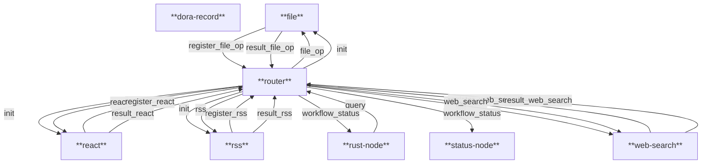
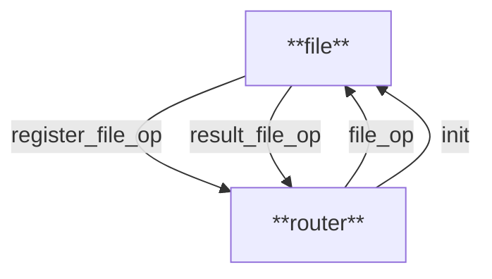

# 📖项目介绍

此项目是一个基于`dora`的多agent交互项目，可以任意扩展不同的agent来实现特定的功能，每个agent在`dora`的概念中属于一个node。

在基于`dora`的通信上定义了通信交互协议来让`router`进行元数据的构建达到决策的目的。


当前项目整体交互如下：




## 📘 模块说明表


| 组件名称        | 描述                                                         |
| --------------- | ------------------------------------------------------------ |
| **router**      | 中央调度模块，负责初始化各组件、注册操作、处理流程状态和结果分发。 |
| **file**        | 文件处理模块，执行读写等文件操作。                           |
| **react**       | 自思考和打分总结输出最佳答案模块。                           |
| **rss**         | RSS 抓取模块使用**rsshub**，负责获取 RSS 内容并处理返回目前支持还都是固定的几个暂时还不支持中文。 |
| **web-search**  | 网页搜索模块基于**thirtyfour**，支持关键词搜索、点击、正文提取等功能。 |
| **rust-node**   | 上层应用调用者，包含一个server，可发起查询请求，接收任务处理结果与状态，实现sse交互有一个静态页面，启动后会自动打开。 |
| **status-node** | 状态监听节点，用于接收流程状态（如运行中、成功、失败）等信息。 |
| **dora-record** | 操作记录模块，用于记录任务流程、调试信息或历史追踪。         |


## 💼本地环境

本地开发环境使用`rust`,`dora`,`web-search` ,`dora-record`,`ollama`依赖所以需要安装`chromedriver`和`dora-record`,`ollama`


```text
brew install ollama
ollama pull qwen2.5-coder:32b
ollama pull qwen2.5-coder:14b
brew install chromedriver
cargo install dora-cli --locked
cargo install dora-record --locked
cargo xtask run
```

运行可以直接`cargo xtask run`

记得修改`config.toml`

> 这里说一下目前好像ollama的tools call在openai的兼容性上不如ollama的本地api，有时候会导致不调用tools（我本地实验是这样的，不代表所有人，具体原因还没有查明），所以建议在web-search中使用rig本地的ollama的客户端
>
> 再由于没有写Feature来条件编译所以只能改动一下代码
>
> ```rust
> let openai_client = providers::ollama::Client::new();
> ```

下面的配置均是openai的客户端

```toml
[node]
key = ""
url = "http://localhost:11434/v1"
#model="gpt-3.5-turbo"
model="qwen2.5-coder:14b"

[status-node]
key = ""
url = "http://localhost:11434/v1"
#model="gpt-3.5-turbo"
model="qwen2.5-coder:14b"

[reactor]
key = ""
url = "http://localhost:11434/v1"
#model="gpt-3.5-turbo"
model="qwen2.5-coder:14b"


[router]
key = ""
url = "http://localhost:11434/v1"
#model="gpt-3.5-turbo"
model="qwen2.5-coder:32b"


[file_op]
key = ""
url = "http://localhost:11434/v1"
#model="gpt-3.5-turbo"
model="qwen2.5-coder:14b"

[web_search]
key = ""
url = "http://localhost:11434/v1"
#model="gpt-3.5-turbo"
model="qwen2.5-coder:14b"
```


# 💻开发

## 🤖如何新增agent

可以接入现有的dora node生态，不过需要添加一个中间层来进行注册和消息处理，这里其实可以模版化，加快开发


因为有多个node需要同时编译和启动，所以本项目基于rust的xtask风格


整体设计只有2个重要关键组件，其余agent均为可随意动态去除和添加

- common : 项目通用的一些抽象和定义

- router:  项目大脑负责决策使用哪些agent来进行此次任务的处理，根据结果自动根据组装不同的agent输入参数

在common中有以下结构体定义

```rust
//node节点注册
pub struct NodeDescriptor {
    pub id: String,          // 唯一 ID
    pub description: String, // 节点作用
    pub inputs: String,      // 整个 inputs 作为 JSON
    pub outputs: String,     // 整个 outputs 作为 JSON
    pub aggregate: bool,		// 指示该节点是否需要聚合所有前置结果
}
//每个节点完成后接收和发送的数据，整体由router作为大脑做统一调度分发处理
pub struct FlowMessage {
    pub workflow_id: String,        // 工作流 ID
    pub node_id: String,            // 当前节点 ID（与 NodeDescriptor.id 对应）
    pub input: Value,               // 节点原始输入（NodeDescriptor.inputs 解析后的 JSON）
    pub prev_result: Option<Value>, // 上一步节点的结果（首次调用时为 None）
    pub result: Option<Value>,      // 当前节点处理后的结果（节点返回时填写）

    #[serde(default)]
    pub aggregated: Option<String>,  // 如果存在，表示聚合结果应填入此字段
}
//运维监控专用信息，目前主要由router发送一些信息，别的agent也可以发送该消息
pub struct WorkflowLog {
    pub workflow_id: String,
    pub node_id: String,
    pub step_index: usize,
    pub total_steps: usize,
    pub status: String,
    pub input: Value,
    pub output: Value,
    pub message: String,
}
```

创建一个新agent可以使用以下命令直接建立

```shell
dora new --kind node {agent} --lang rust
```

会直接在项目中初始化最基本的dora项目，当初始化项目后请记得在跟目录下的Cargo.toml加入[members]

例子：

```toml
[workspace]
resolver = "1"
members = ["xtask","node","web-search","status-node", "router","common","file","reactor","rss",{agent}]
```

加入router这里以操作文件的agent为例子首先需要定义自己的agent的id(这里可以直接用名字)之后，router会根据init消息中发送的`NodeDescriptor`的id来进行注册处理，这里请注意，由于当前dora不支持多node同名id接收，所以以固定前缀的方式来标识消息类型`node.send_output`可以看到这里使用的是`register_id(id)`而不是单纯的id，同理router发送消息给agent的时候，在接收到消息后需要使用`result_id(app_id)`来包装，详情可以看`router`的实现

```rust
let app_id="file_op";
while let Some(event) = events.recv_async().await {
        match event {
            Event::Input { id, metadata, data } => match id.as_str() {
                 // 初始化事件：注册当前节点信息到 router
                "init" => {
                    let registration = NodeDescriptor {
                        id: app_id.to_string(),
                        description: "文件操作节点，支持创建文件夹、删除文件夹、创建文件、删除文件、更新文件和读取文件".to_string(),
                        inputs: serde_json::to_string_pretty(&schema_for!(Vec<FileOperationArgs>)).unwrap(),
                        outputs: "字符串类型，操作结果或读取的文件内容".to_string(),
                        aggregate: false,
                    };
                    node.send_output(
                        register_id(id),
                        metadata.parameters,
                        registration.into_arrow(),
                    )?;
                }
                // 当收到 "file_op" 事件时，处理文件操作任务
                "file_op" => {
                    // 直接将接收到的数据转换为 FlowMessage
                    let mut flow_msg: FlowMessage = FlowMessage::try_from(data)
                        .context("file_op 节点期望接收到 FlowMessage").unwrap();
                    let received_input_str = if let Some(s) = flow_msg.input.as_str() {
                        s.to_string()
                    } else {
                        serde_json::to_string(&flow_msg.input)?
                    };
                  ........
                    let new_flow_msg = FlowMessage {
                        workflow_id: flow_msg.workflow_id,
                        node_id: app_id,
                        input: flow_msg.input,
                        prev_result: flow_msg.result,
                        result: Some(serde_json::to_value(result)?),
                        aggregated: None,
                    };
                    node.send_output(
                        result_id(app_id),
                        metadata.parameters,
                        new_flow_msg.into_arrow(),
                    )?;
                }
              ......
            },
						......
        }
    }
```

所以关键在于注册需要发送自己节点的`NodeDescriptor`信息，当收到router发送的`FlowMessage`消息时需要进行处理，最后组装发送自己的`FlowMessage`来进行整个逻辑交互从流程图上单个agent交互如下




之后`dataflow.yaml`中写如下配置

```yaml
nodes:
  - id: file
    build: cargo build -p file
    path: ./target/debug/file
    inputs:
      init: router/init
      file_op: router/file_op
    outputs:
      - register_file_op
      - result_file_op

  - id: router
    build: cargo build -p router
    path: ./target/debug/router
    inputs:
      register_file_op: file/register_file_op
      result_file_op: file/result_file_op
    outputs:
      - init
      - file_op
```


## 🚀后续优化计划

- 这里说明一下在这个设计中可以再缩小到一个agent再去做出自己的workflow一套循环来得到最好的答案，因为本身有的llm也是支持tools的所以每个模块可以再实现自己的tools来完整整体功能

- `web-search` 开发了好几版本身是希望llm自己解析html，然后再深入点击的功能，但是由于是本地推理而且效果不好并且速度极慢最后恢复到第一版固定选择器，后续这块还可以再优化思路可以参考这篇[Browser Use](https://mp.weixin.qq.com/s/GbEhX8SPbYvHFW8BRANVHg)
- `rss`支持更多的搜索以及llm智能化根据输入来判断应该查询哪些rss
- `router` 的思考选择、流程优化和最后结果的生成优化
- 模版化复用`dora`生态的node
- 当前协议其实比较粗糙，可以再规范化协议
- 支持对当前操作系统的相关调用，命令行和环境自搭建
- 可以支持虚拟环境
- 需要一个完善的前端展示以及对前端输出的优化
- 使用Feature来支持对rig的ollama和openai的api Client区分实现

